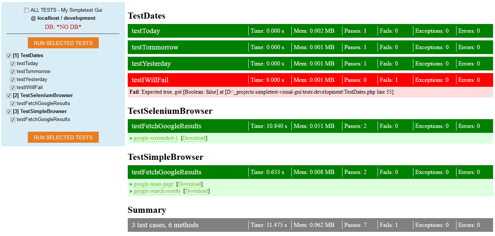

# Simpletest Visual GUI

* Version: 1.0.0
* Release date: 08.04.2014

This is simple customizable visual user interface for running unit tests written for [SimpleTest](http://simpletest.org/) unit testing framework.
It provides simple friendly listing of available unit tests and displays test results.

## Installation

Unzip into your application's apropriate place, e.g. under subdirectory "extensions" or "vendor".
If using MVC framework, create dedicated controller e.g. "TestController" inside administration module/section to ensure only authorized access.
You can actually move the content from file "index.php" into "testController".
By accessing "index.php" (or "TestControler") you should be able to load listing of available tests.

Once unzipped, following directories will be available:
* /gui/  .. main application directory, that also includes "/vendor/" subdirectory with simpletest and php web bindings.
* /log/  .. output directory for logging, must be writable
* /temp/  .. output directory for temporary files created during tests as well as snapshots and/or screenshots. Must be writable.
* /tests/  .. all unit tests divided into subdirectories depending on environment type (development, testing, production)
* index.php  .. bootstrap script that may be moved into MVC controller.
* jquery.min.js  .. just auxiliary JS library, remove loading link from /gui/template1.php if your application already load jquery.
* start-selenium-server.bat .. is a command line for starting standalone selenium server for WebTest runners.

## Writing unit tests

There are assumed 3 development environments that corresponds to subdirectories inside /tests/*:
* /tests/development - these tests are assumed to run ONLY during development stage
* /tests/testing - these tests are assumed to run ONLY during testing stage
* /tests/production - these tests are assumed to run ONLY on production servers

Please check out supplied test examples.
They include web browser sample test for built-in SimpleBrowser as well as for Selenium Server with PHP web bindings.

## Customization

Please note, that the purpose of this utility is to provide easy customizable inteface for you.
It is not intended to be perfect with beautiful graphical interface, but rather practical and easy customizable. 
You may want to modify:

* output rendering template (by default it is set to "/gui/template1.php")
* directory deployment - please refer to "index.php" where are defined few constants:
	* DIR_TESTS .. absolute path to directory root with all tests
	* DIR_TEMP .. absolute path to temporary directory
	* DIR_LOG .. absolute path to directory for logging
	* DIR_FRAMEWORK .. absolute path to directory with simpletest framework and PHP web bindings.

## Security considerations
		
Please note, that this utility is meant to be integrated part of your application.
It is NOT meant to be standalone PHP application.
Therefore it does not provide any authentication mechanism - it is assumed, that the user accessing unit tests is already authorized user (probably administrator).
		
## Running Selenium Server

The built in SimpleBrowser is sufficient for testing static pages, but it cannot handle/process javascript events.
For this purpose, you need to use selenium server only.

Steps for running Selenium Server via SimpleTest Visual GUI:

1. download selenium server from http://docs.seleniumhq.org/download/
2. place it into some separate directory, e.g. /selenium/
3. if needed, create logging subdirectory, e.g. /selenium/log/
4. install java. Ensure, that java is visible in your command line - in CLI window write "java -version" to see, that java is accessible. If not, add path to java bin directory (e.g. "c:\Program Files\Java\jre7\bin\") to your system environmental variable "PATH".
5. create file /selenium/**start-selenium-server.bat** with following content:
~~~
java -jar d:\projects\selenium\selenium-server-standalone-2.41.0.jar -log ./log/selenium.log -trustAllSSLCertificates
(adjust path to *.jar file)
~~~
6. run file /selenium/start-selenium-server.bat - it should start selenium server. Now you can run unit tests with selenium server via Simpletest Visual GUI.

### Reporting bugs

Please report bugs to lubosdz AT hotmail DOT com.

### Enjoy!
